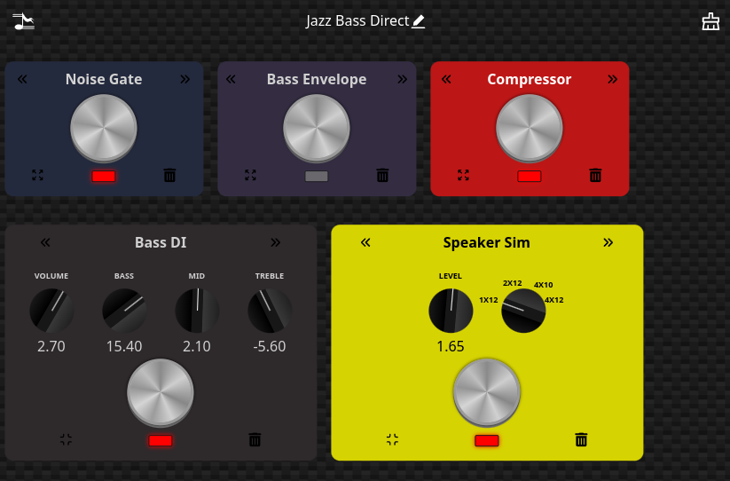

# pedal-board

Looking for a digital pedal board?  Something that will let you build a stack of effects to process audio, make adjustments, and save the results?  The PedalBoard is designed to let you do that.

This crate came out of a separate project to allow for real time multi-person audio conferecing.  A feature of that project was to allow users to create software pedal boards for their channels that they could apply to their audio streams.  For example a nice reverb for their vocal channel and some various effects for an instrument channel.

## Examples

There are two examples. The first [main] just demonstrates how to create a PedalBoard, add some pedals, and how you can call it.  For example, this is how you get a list of the pedals currently supported by the crate.  It also shows how you build a pedalboard and add some pedals to it.  THis example creates a chain with a Compressor, Delay, Reverb, and a simple amp model called "Champ".

```rust
use pedal_board::PedalBoard;


fn main() -> () {

    // Printout list of pedal types we know about
    let pedal_types = PedalBoard::get_pedal_types();

    println!("Types of pedals");
    println!("{}", serde_json::to_string_pretty(&pedal_types).unwrap());

    // lets build a pedal board
    let mut board = PedalBoard::new(3);

    // Insert pedals in reverse order (it puts each on at the front)
    for pedal in ["Champ", "Sigma Reverb", "Delay", "Compressor"] {
        board.insert_pedal(pedal, 0);
    }

    let board_json = board.as_json(0);
    println!("Here is the json for that board");
    println!("{}", serde_json::to_string_pretty(&board_json).unwrap());
}
```

The second example shows how you can create a pedal board and then put it into an alsa audio stream.  This runs on linux systems that have an alsa i/o device that can support full duplex 2 channel input/output with a 48_000 Hz sample rate and 16 bit integer I/O.  Once built you can run it with

```bash
$ ./target/release/examples/alsa_io -h
Usage: alsa_io [OPTIONS]

Options:
  -i, --in-dev <IN_DEV>    input alsa device [default: hw:CODEC]
  -o, --out-dev <OUT_DEV>  output alsa device [default: hw:CODEC]
  -h, --help               Print help
```

For a behringer U-Phoria UMC22 it registers with alsa as "CODEC".  You can see via


```bash
$ aplay -l
**** List of PLAYBACK Hardware Devices ****
card 0: Generic [HD-Audio Generic], device 3: HDMI 0 [LF32TU87]
  Subdevices: 1/1
  Subdevice #0: subdevice #0
card 0: Generic [HD-Audio Generic], device 7: HDMI 1 [HDMI 1]
  Subdevices: 1/1
  Subdevice #0: subdevice #0
card 0: Generic [HD-Audio Generic], device 8: HDMI 2 [HDMI 2]
  Subdevices: 1/1
  Subdevice #0: subdevice #0
card 1: CODEC [USB Audio CODEC], device 0: USB Audio [USB Audio]
  Subdevices: 1/1
  Subdevice #0: subdevice #0
card 2: Generic_1 [HD-Audio Generic], device 0: CX20632 Analog [CX20632 Analog]
  Subdevices: 1/1
  Subdevice #0: subdevice #0

```

To run the alsa demo, you can 

```bash
$ ./target/release/examples/alsa_io -i hw:CODEC -o hw:CODEC
```

make sure to build and run in release mode to support 128 sample frames at 48_000 samples/sec

## Docs

There are lots of docs in the library.  Build the docs with 
```bash
cargo doc --no-deps
```
docs will be in target/doc/pedal_board/index.html

Current Pedal Types

## Pedal Types

You can ask the library for the list of pedals it supports. Right now there are

```rust
    pub fn get_pedal_types() -> serde_json::Value {
        json!({
           "Template Pedal": "Sample pedal template",
           "Tone Stack": "Tone controls (3 band)",
           "Noise Gate": "Noise Gate",
           "Bass DI": "Bass Guitar Tone Shaping",
           "Speaker Sim": "Speaker Cabinet Simulator",
           "Sigma Reverb": "Sigma Reverb",
           "Compressor": "Compressor Pedal",
           "Tremelo": "Tremelo ala Fender",
           "Delay": "Delay Pedal",
           "TubeDrive": "Tube Overdrive",
           "Tube Screamer": "Tube Overdrive Modeled From The Classic",
           "SoulDrive": "Soul Overdrive",
           "Chorus": "Chorus",
           "Bass Envelope": "Bass Envelope Filter Pedal",
           "Guitar Envelope": "Guitar Envelope Filter Pedal (auto-wah)",
           "Champ": "Fender Champ",
           "Princeton": "Fender Princeton",
           "Room Simulator": "Room Simulator for rich sound",
        })
    }
```

## DSP Functions

The pedals are built on a small library of dsp functions. These provide the building blocks for making pedals.  Biquad filter, delay line, moving average, attack hold release, etc.  There is also a pitch detector that was a direct export of the faust library pitch_detector function.  This along with some filtering allows for the Tuner module. 

## U/X

This libary does not provide a u/x for the pedals.  We have built a generic pedal u/x in the rtjam nation project.



This is a sample pedalboard made up of a Noise Gate (currently enabled (bypass = false)), a bass envelope filter (auto wah, turned off), a compressor, a Bass DI box (simulates the Ampeg tone stack with a soft clip function), and a Speaker Sim modeling a 1x12 cabinet.

This u/x is written in react.js and requires some communication with the application that is running the pedalboards.  A Tauri app is in development and will be put out opensource once it is ready.
